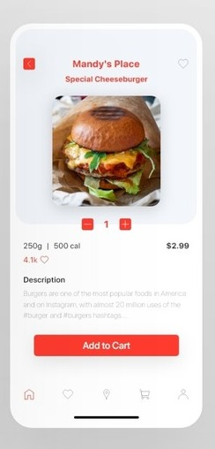

# Project0
## _AndroidDemo_
Using Kotlin and Android version 10
## Student Info 
| Name | Student No. |
| ------ | ------ |
| Mahsa Ghaderan | 96521416 |
| Ahmadreza Sanatjou | 96521326 |

## Demo 

## Used Tags

- ScrollView
- ConstraintLayout
- LinearLayout
- ImageView
- ImageButton
- CardView
- TextView

#أ# Notes

- All resources are extracted as variables
- All responsive behaviours are handled by constraintLayout
- To avoid verical collapses for smaller screens, scrollView is used

